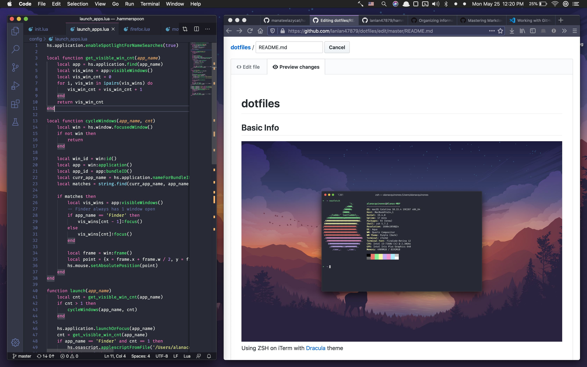

# dotfiles

## Basic Info

Using ZSH on iTerm with [Dracula](https://draculatheme.com/) theme

### ZSH and VIM
Files have basic config stuff nothing too fancy

### Karabiner
Remapped the 'x' key to act as a hyper key that controls Spotify through an [Alfred workflow](https://alfred-spotify-mini-player.com/). Tutorial to configure more keys like this can be found [here](https://medium.com/@nikitavoloboev/karabiner-god-mode-7407a5ddc8f6). 

NOTE: It's very easy to trigger these keys accidentaly while typing. I've looked but haven't really found a work around for this behavior. If I had, I would definitely have more of these set up.

Some of the stuff I can do with this 'x' key
* Start playing a specified playlist by pressing x + j
* Skip to next song/skip to previous song by pressing x + c and x + z
* Browse my playlists by pressing x + p (activates Spotify Alfred workflow)
* Search Spotify by pressing x + f (activates Spotify Alfred workflow)
* etc...

### Hammerspoon
Managed to set up some basic window management features. I've used other WMs ([Magnet](https://magnet.crowdcafe.com/), [yabai](https://github.com/koekeishiya/yabai), and [Mosaic](https://www.lightpillar.com/mosaic.html)) and I've tried to incorporate features I've really enjoyed from those. Right now, this uses hotkeys to:
* Focus on windows up/down/left/right of the current window
* Snap windows up/down/left/right, in quarters, and in thirds 
* Increase/decrease the width and height of the curent window
* Move windows up/down/left/right by increments

Features I wanna add include:
* Adding a border around the current window
* Figuring out a way to move windows accross spaces

NOTE: I'm currently using a Keyboard Maestro macro found [here](https://forum.keyboardmaestro.com/t/move-frontmost-window-to-a-different-space/10512) to do this. It moves windows by focusing the mouse on an application's title bar and simulating a hotkey that moves me to a different space. It's reliable and it works great but I'd rather find something that works a little faster and is cheaper than KM.

### BetterTouchTool
Configured trackpack actions that let me:
* Open, close, and navigate Firefox and Finder tabs
* Control volume, Spotify pauseplay, and Spotify next track and previous track
